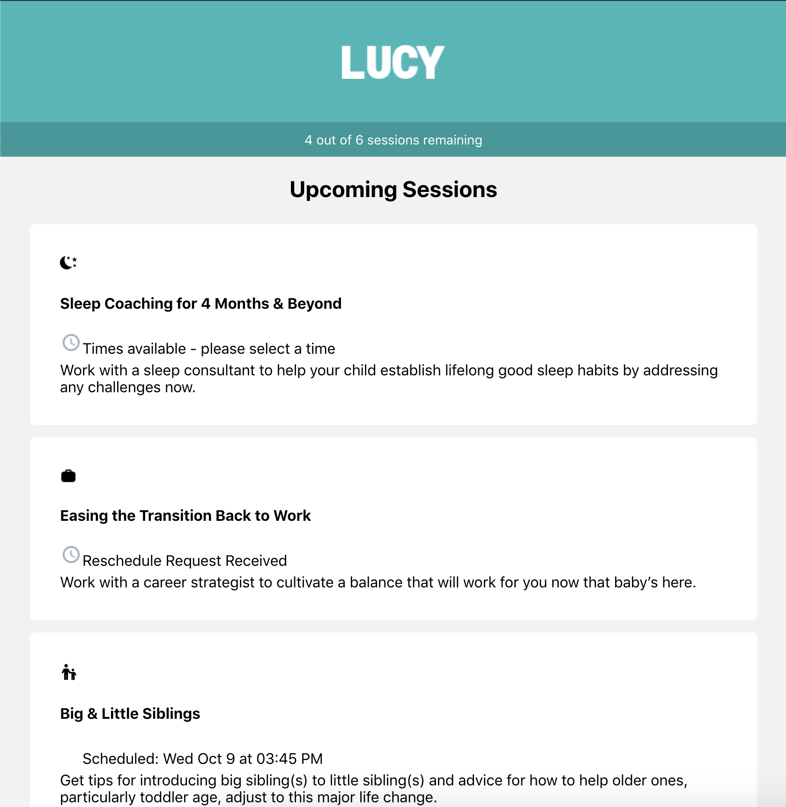
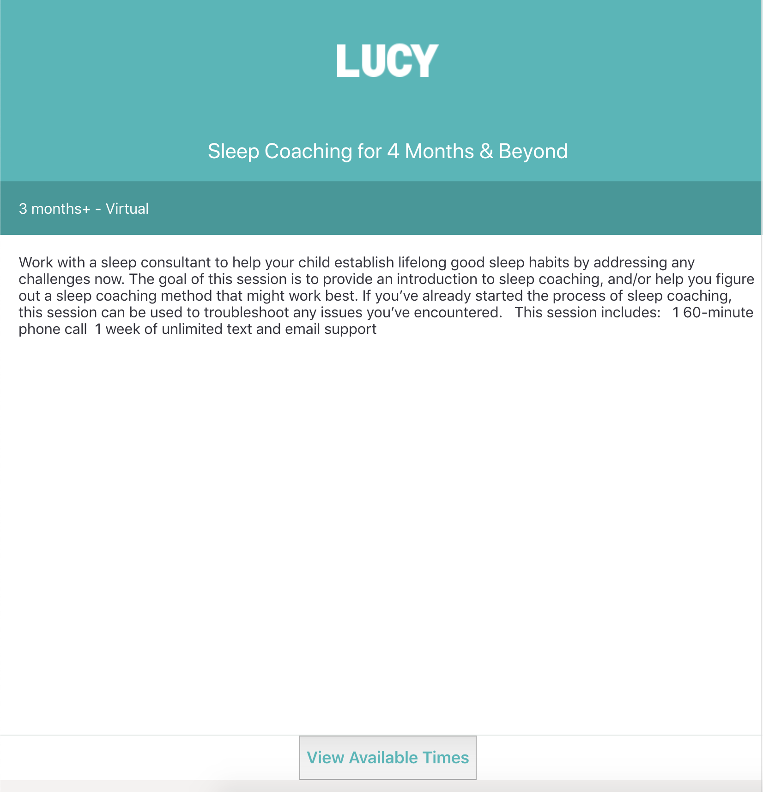

# Code Review Interview (React)

This project is designed to test your code review skills. We've taken some code from a very old version of our React Native app, converted it to web, and made some questionable alterations.

Some things we'll be assessing from your review:

1. Knowledge of JavaScript and React conventions
2. Spotting React and JavaScript antipatterns
3. Anticipating bugs
4. Communication style

## Tips

1. Instead of just saying why something is wrong, explain why you think it should be done differently.
2. Provide examples and/or external resources whenever you can to support your claims. The more authoritative, the better!

## Context

This app shows a list of "sessions", which are appointments that a user can schedule with one of the company's experts. A session can be in different scheduling states and :

1. **Unscheduled** (default state)
2. **Times Requested**: user has provided their general availability and is waiting for us to send a list of possible times when the expert is available.
3. **Times Provided**: we have sent a list of possible times and are waiting for the user to confirm a time.
4. **Scheduled**: user has confirmed a time and the session is set to occur at that time.
5. **Completed**: session occurred at the scheduled time.
6. **Cancelled**: user or experted cancelled the appointment

#### Care Plan

Shows a list of all sessions, separated into different categories.

#### Session

